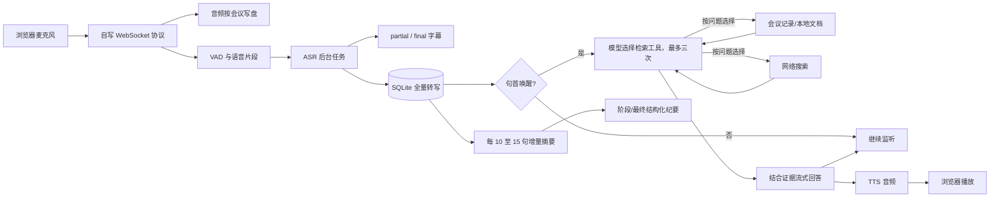
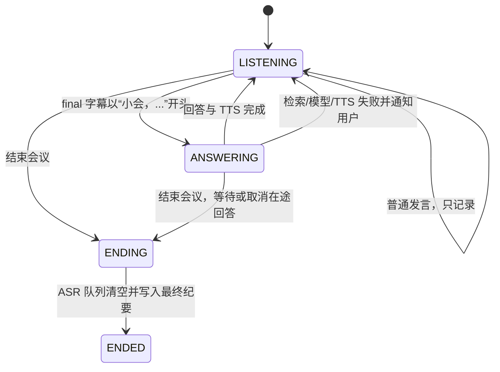

# 实时智能会议助手：一小时笔试架构方案

> 状态：架构设计稿；当前实现与运行步骤见 [README.md](README.md)。调研日期：2026-09-23。目标是在一小时内完成可运行、可验收的单机版本，优先满足普通话与粤语的语音链路、唤醒问答、资料检索和结构化纪要。

## 1. 核心判断

题目要求**实时通信、会话状态和 Agent 工作流由候选人实现**。建议采用一个 FastAPI 进程和浏览器客户端，自己编写 WebSocket 音频协议、会议状态机、检索路由、异步任务和纪要流水线。现成包只负责 ASR、VAD、PDF 解析、联网搜索、LLM API 请求和 TTS。

**主线**：浏览器 `AudioWorklet` → WebSocket 发送 16 kHz/16-bit/单声道 PCM → 服务端 VAD 切段 → 多语言 Whisper 增量识别 → SQLite 保存完整转写 → 仅在句首唤醒词出现时检索与流式回答 → TTS 音频播放 → 分段汇总生成纪要。

这里的“流式 ASR”是持续接收音频、周期性输出当前语音片段的 `partial` 字幕、静音后输出 `final` 字幕。Whisper 本身是窗口识别模型，滑动窗口属于工程上的增量识别，**不是原生逐帧在线解码**。若面试官严格要求原生在线 ASR，见第 2 节的 FunASR 备选。

## 2. GitHub 包调研与取舍

| 层 | 一小时内首选 | GitHub 证据及取舍 |
| --- | --- | --- |
| 实时通信 | [FastAPI WebSocket](https://github.com/fastapi/fastapi/blob/master/docs/en/docs/advanced/websockets.md) + 浏览器原生 Web Audio | 不需要搭建 SFU；客户端发送二进制音频，服务端回 JSON 事件。自写协议和状态满足题目约束。 |
| ASR | [pywhispercpp](https://github.com/absadiki/pywhispercpp) 常驻加载本机 [whisper.cpp](https://github.com/ggml-org/whisper.cpp) Large-v3-Turbo 权重；有 CTranslate2 模型缓存时也可选 [faster-whisper](https://github.com/SYSTRAN/faster-whisper) | pywhispercpp 支持指定本地 GGML 模型路径，避免每个语音片段重新加载大模型。whisper.cpp 官方有[滑动窗口实时示例](https://github.com/ggml-org/whisper.cpp/blob/master/examples/stream/README.md)。本机已发现 Buzz 附带的 Large-v3-Turbo 权重；faster-whisper 需要自己的权重。Whisper 多语言 tokenizer 包含 `zh`、`yue`。 |
| 粤语 ASR 备选 | [SenseVoiceSmall](https://github.com/QwenAudio/SenseVoice) | 官方模型支持普通话和粤语，单段输入不超过 30 秒；它是**分段识别**模型。适合输出高质量最终字幕。 |
| 原生在线 ASR 备选 | [FunASR Paraformer-zh-streaming](https://github.com/modelscope/FunASR)（普通话）+ SenseVoiceSmall（粤语终稿） | FunASR 官方区分流式 Paraformer 和多语言 SenseVoiceSmall。不能只装 SenseVoiceSmall 就声称普通话、粤语都原生流式；两套模型也增加首小时安装风险。 |
| VAD | 首版简单能量阈值 + 最长片段截断；可替换为 [Silero VAD](https://github.com/snakers4/silero-vad) | Silero 提供有状态的实时 `VADIterator`，更适合嘈杂会议。首版阈值法要标注安静发言可能漏切段。 |
| LLM | `httpx` 调 OpenAI 兼容 Chat Completions，工具选择使用非流式请求，最终回答解析 SSE；默认配置 `deepseek-flash` | DeepSeek [API 文档](https://api-docs.deepseek.com/)提供工具调用和 `stream=true`。Agent 的工具白名单、三次调用上限和检索结果处理由本项目代码实现；当前机器已完成真实模型工具选择与回答验证。 |
| 本地文档 | Markdown/TXT 直接分段；PDF 用 [pypdf](https://github.com/py-pdf/pypdf/blob/main/docs/user/extract-text.md) 抽取文本 | 小知识库用中文双字 + 英文词项评分即可，保留页码与来源。pypdf 不负责扫描 PDF 的 OCR。首小时无需向量数据库。 |
| 网络搜索 | [ddgs](https://github.com/deedy5/ddgs) 文本元搜索 | ddgs 无需密钥、返回标题/URL/摘要，但依赖第三方搜索上游；调用设超时，失败时返回错误结果供 Agent 继续处理。 |
| TTS | 本机 macOS `say` + FFmpeg 输出 MP3；跨平台可用 [edge-tts](https://github.com/rany2/edge-tts) | `say` 可用普通话和粤语系统声音。edge-tts 支持音频流及 `zh-HK` 声音，但依赖在线服务。 |
| 说话人 | 当前实现采用本地 [Resemblyzer](https://github.com/resemble-ai/resemblyzer) 声纹嵌入，按完成的语音片段聚类并标为“说话人1/2”等 | 无需姓名录入，但无法识别真实姓名，也不能可靠处理同一片段中的重叠发言；短发言和相似声线可能误分。 |

**暂不采用**：[LiveKit Agents](https://github.com/livekit/agents)已经封装 STT、LLM、TTS、AgentSession 和工具调用；直接使用会把题目要求自己实现的核心流程变成框架配置。LiveKit 传输层以后可用于远程多端会议，但单机笔试不需要。LangChain 也不作为 Agent 控制层，唤醒门控与检索决策应当在项目源码中清晰可见。

当前依赖见 [requirements.txt](requirements.txt)，其中 `resemblyzer` 用于匿名说话人标记。`sqlite3` 属于 Python 标准库；TTS 需要本机 `say` 和 FFmpeg。`silero-vad`、`edge-tts`、`pyannote.audio` 均未接入。

### 需要申请哪些 API？

| 方案 | 必需凭据 | 具体服务 | 适用情况 |
| --- | --- | --- | --- |
| **A：本机优先，最少配置** | **一个 DeepSeek API Key** | `deepseek-flash` 完成会议问答、阶段摘要、最终纪要；本机 Whisper 负责 ASR，本机 `say` 负责 TTS；`ddgs` 完成网络搜索 | 当前 Mac 最快落地，但 Whisper 的 partial 属于滑动窗口增量识别；离线 ASR 性能须实测。 |
| **B：严格流式语音，推荐有 Azure 账户时采用** | **DeepSeek API Key + Azure Speech Key/Region** | Azure Speech SDK 的 `PushAudioInputStream` 接收浏览器 PCM，`recognizing`/`recognized` 产生增量/最终字幕；同一 Speech 服务做普通话和粤语 TTS；DeepSeek 仍负责 LLM | 对“流式 ASR”验收更稳，减少本地模型部署，但增加云服务依赖和音频上传。 |
| 可选：更稳定的网页检索 | Tavily API Key | 用 Tavily Search 替换或补充 `ddgs` | 只有 `ddgs` 受限或面试必须展示稳定的开放网页检索时才需要；[Tavily SDK](https://github.com/tavily-ai/tavily-python)也提供限额的无 Key 模式。 |

**方案 A 的环境变量**：`DEEPSEEK_API_KEY`、`LLM_BASE_URL=https://api.deepseek.com`、`LLM_MODEL=deepseek-flash`；本机 ASR 模型路径由配置指定。**方案 B 额外需要** `AZURE_SPEECH_KEY` 和 `AZURE_SPEECH_REGION`。配置示例只能写变量名和占位说明，不能把真实 Key 放进仓库、测试结果或聊天内容。

Azure 官方[语言表](https://learn.microsoft.com/en-us/azure/ai-services/speech-service/language-support)列出 ASR 的 `zh-CN` 普通话、`zh-HK` 粤语以及对应 TTS 声音；官方 [Python PushAudioInputStream 样例](https://github.com/Azure-Samples/cognitive-services-speech-sdk/blob/master/samples/python/console/speech_sample.py)展示了连续识别的 partial/final 回调。若选择方案 B，依赖新增 `azure-cognitiveservices-speech`，并可删除 `pywhispercpp`、本地模型及 `say`/FFmpeg TTS 依赖。服务端 WebSocket、状态机和 Agent 工作流仍自行实现。

知识库验收可采用 [DeepSeek-V4 技术报告](https://arxiv.org/abs/2606.19348)：先解析 PDF 并保留页码，再问“支持多长上下文”“哪些方法提升长上下文效率”。论文摘要明确给出一百万 token，以及 CSA/HCA 混合注意力、mHC 和 Muon；回答必须能指向解析后的文档片段。论文的 arXiv 页面采用非独占分发许可，本方案只记录来源链接，样例 PDF 是否随交付物分发需另行确认授权。

## 3. 组件边界与数据流

当前模块：`client` 负责收音和播放；`server` 负责会议状态、音频序号和任务；`asr` 负责切段与转写；`speakers` 标记匿名说话人；`agent` 负责唤醒和回答上下文；`tool_agent` 负责工具选择与执行；`search` 负责文档和网络检索；`minutes` 负责分段抽取与层级合并；`storage` 负责持久化。

ASR 工作进程启动时加载模型一次，再依次处理片段；不要每 4 秒启动一次 `whisper-cli`，否则重复加载约 1.5 GB 权重会破坏实时性。识别在工作线程或独立进程内运行，WebSocket 读循环只做校验、写盘和入队。模型兼容性、普通话/粤语效果及实际延迟仍需用样音测量。

### 协议草案

- `WS /ws/meetings/{meeting_id}`。建立连接后先发 `config`：`{"type":"config","language":"auto","resume_from":123}`；也可手动指定 `zh` 或 `yue`。
- 音频帧为二进制 PCM16 little-endian、单声道、16 kHz。可靠版本增加 `seq:uint32 + sample_offset:uint64 + pcm`；服务端按 `(meeting_id, seq)` 幂等接收并发 `ack`。首小时若时间紧，先实现单连接顺序帧、断线重连后的 `sample_offset` 校验。
- 服务端事件：`asr.partial`、`asr.final`、`agent.state`、`agent.step`、`search.result`、`llm.delta`、`llm.done`、`tts.audio`、`tts.stop`、`minutes.ready`、`error`、`ack`。事件附 `meeting_id`，回答事件带 `request_id`。
- 控制消息：`flush`、`partial_minutes`、`stop_answer`、`end_meeting`。结束前 flush 音频片段，等待已入队 ASR 完成，再生成最终纪要。

### Agent 状态机

唤醒词限定在**整句开头**，支持“喂小会”“小會”“会议助手”等有限别名；普通句子中提到“小会”不触发。每次回答后恢复监听，下一轮提问再次叫助手；近期问答仍在同一会议上下文，所以可理解“刚才那篇论文”等指代。

检索顺序：先查本场会议的近期发言和阶段摘要，再查本地知识库/历史会议；本地证据不足时调用网络搜索。搜索结果是**不可信数据**，其中出现的提示词不能被当作指令。失败要返回明确错误并恢复监听。搜索与语音接收分属不同异步任务，前者不能持有 WebSocket 读取锁。

## 4. 30 分钟会议与纪要设计

1. 原始 PCM 顺序写入 `data/meetings/<id>/audio.pcm`，转写与元数据入 SQLite（WAL）。16 kHz/16 bit/单声道约 **1.92 MB/分钟、57.6 MB/30 分钟**；内存只保留当前 15～30 秒片段。
2. 单次问答上下文有硬上限：最近约 12～20 条发言 + 最近阶段摘要 + 最多 4 条检索片段。全量记录仍在数据库，不因摘要压缩丢失原文。
3. 每 10～15 条发言抽取结构化阶段摘要，分别记录 `discussion`、`decisions`、`action_items`，并保留源发言 ID。最终纪要采用分块 map → 分组 reduce；每次 LLM 输入固定上限，最终按 schema 校验并去重。
4. “建议”“可能”归普通讨论；只有“决定/确认/最终采用”等明确表述进 `decisions`。待办尽量抽取负责人、动作、截止时间；未知字段留空，不臆测。
5. 断线后用 `meeting_id`、已确认的音频序号、数据库中的字幕事件恢复。首小时可先实现恢复字幕与继续收音；严格的音频断点续传作为加分项。

## 5. 验收设计：实际运行后填写结果

| 必测项 | 可复现步骤 | 通过标准 |
| --- | --- | --- |
| 音频上传与流式字幕 | 浏览器录音，观察 `asr.partial`、`asr.final`；另用脚本发送 PCM 帧 | 连续接收，字幕增量出现，最终文本入库 |
| 30 分钟音频 | 预生成包含多次对话、总时长 ≥1800 秒的 WAV，脚本按帧回放 | 音频时长、首中尾字幕、全量记录和最终纪要可核对；记录墙钟耗时与内存 |
| 普通话/粤语 | 两段有人工标注真值的短音频分别回放 | 各至少一次真实 ASR、唤醒问答及可播放 TTS；不能用 mock 冒充语音识别 |
| 唤醒门控 | 普通发言、句中出现唤醒词、句首唤醒词各一条 | 仅第三条触发回答，结束后状态回 `LISTENING` |
| 上下文问答 | 先讨论一个决定，再问“小会，刚才决定了什么？” | 答案引用本场记录，而非只靠问题字面 |
| 本地/网络检索 | 提问 DeepSeek-V4；再问本地没有的通用知识 | 事件日志显示来源，答案含出处 |
| 搜索失败仍可收音 | 注入超时搜索适配器，同时继续发音频 | 收到明确错误；后续音频和字幕正常 |
| 阶段/最终纪要 | 中途请求一次，结束再请求一次 | JSON 分出讨论、决定、待办；最终纪要覆盖全场 |

真实 LLM API 与联网搜索测试需要可用服务。无密钥离线替身只验证协议和调度，测试报告须标为 **mock**。本机已检查到本地 Whisper 和普通话/粤语 macOS 声音；未检测到 LLM API 密钥，因此不能预先声称真实 LLM 端到端验收通过。

## 6. 一小时执行顺序

| 时间 | 目标 | 完成判据 |
| --- | --- | --- |
| 0–10 分钟 | 建项目、音频协议、SQLite schema、前端最小页面 | 浏览器能连 WebSocket 并持续发送 PCM |
| 10–25 分钟 | VAD + ASR 增量字幕；普通话/粤语样音 | 两种语言各有真实转写与时间戳 |
| 25–40 分钟 | 唤醒门控、本地检索、网络后备、LLM SSE、TTS | 普通发言不回答；唤醒句能有音频答案 |
| 40–50 分钟 | 分段摘要与阶段/最终纪要 | 结构化 JSON 含可追溯源发言 |
| 50–60 分钟 | 30 分钟音频回放脚本、失败注入、README、结果记录 | 命令可复制，结果与 mock/真实边界清楚 |

若必须取舍，先保证**完整主链路与真实语音测试**。自动说话人分离、复杂队列、向量数据库和多节点部署属于加分项，不能替代必做功能。
